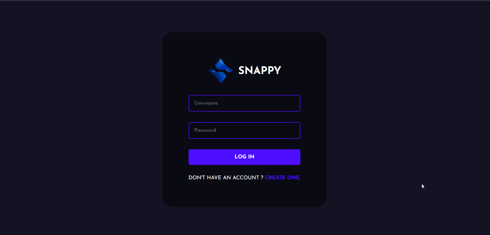
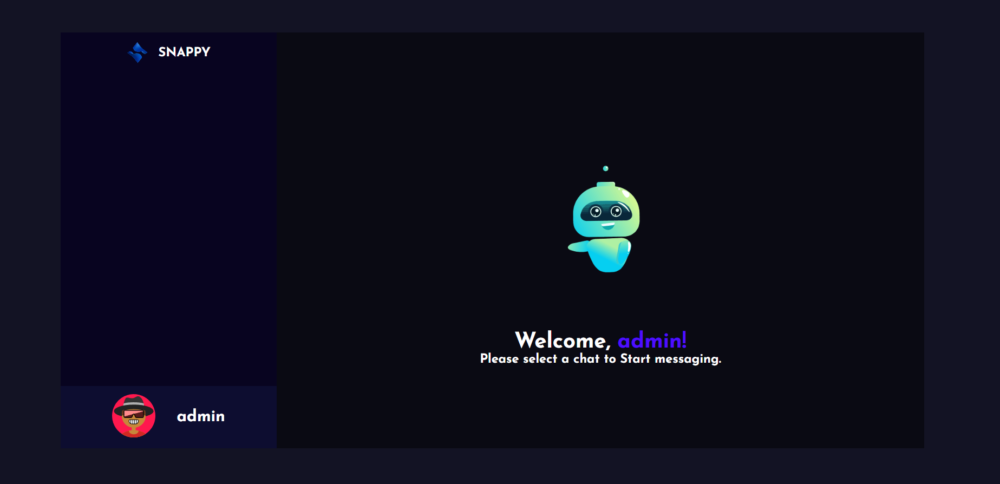

# Snappy - Chat Application 
Snappy is chat application build with the power of MERN Stack.






## Installation Guide

### Requirements
- [Nodejs](https://nodejs.org/en/download)
- [Mongodb](https://www.mongodb.com/docs/manual/administration/install-community/)

Both should be installed and make sure mongodb is running.
### Installation

#### First Method
```shell
git clone
cd chat-app
```
Now rename env files from .env.example to .env
```shell
cd public
mv .env.example .env
cd ..
cd server
mv .env.example .env
cd ..
```

Now install the dependencies
```shell
cd server
yarn
cd ..
cd public
yarn
```
We are almost done, Now just start the development server.

For Frontend.
```shell
cd public
yarn start
```
For Backend.

Open another terminal in folder, Also make sure mongodb is running in background.
```shell
cd server
yarn start
```
Done! Now open localhost:3000 in your browser.

#### Second Method
- This method requires docker and docker-compose to be installed in your system.
- Make sure you are in the root of your project and run the following command.

```shell
docker compose build --no-cache
```
after the build is complete run the containers using the following command
```shell
docker compose up
```
now open localhost:3000 in your browser.

## Deploying to Vercel

This repository is configured to deploy both the frontend and API from the project root using `vercel.json`.

### 1) Set Vercel project root

Set the Vercel project root to the `chat-app` folder.

### 2) Add environment variables in Vercel

Backend:
- `MONGODB_URI` = your MongoDB connection string
- `CLIENT_URL` = your deployed frontend URL (optional, used for local socket CORS setup)

Frontend:
- `REACT_APP_LOCALHOST_KEY` = `chat-app-current-user`
- `REACT_APP_API_URL` = leave empty when API is served from same Vercel domain
- `REACT_APP_SOCKET_HOST` = optional; set this only if socket server is hosted separately

### 3) Redeploy

After saving env vars, trigger a redeploy so frontend build-time variables are updated.

### Notes

- Auth and message REST APIs are served through `/api/*` on Vercel.
- Socket.IO real-time delivery is not reliably supported on Vercel serverless functions for persistent connections; host sockets separately if you need live push updates.